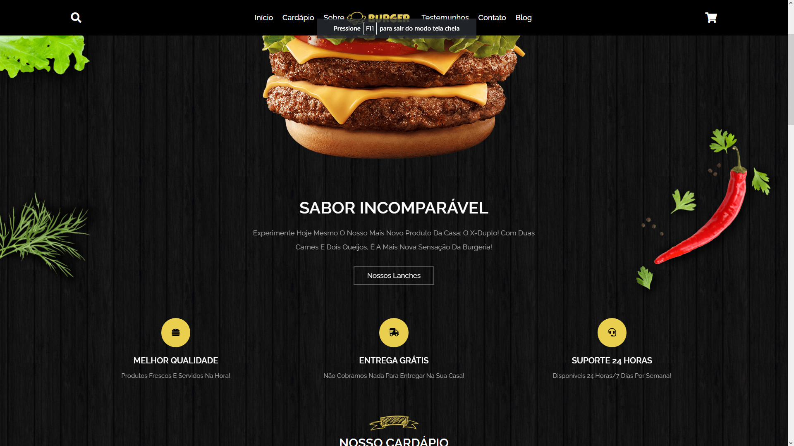
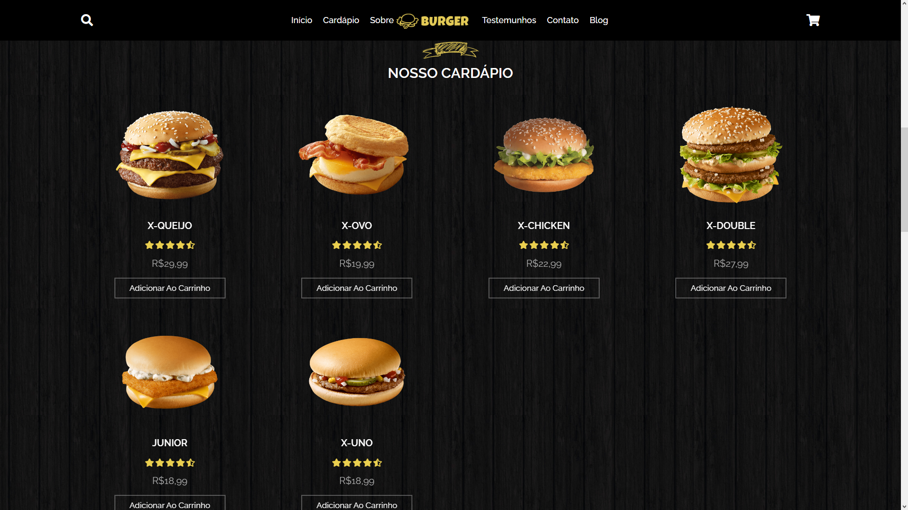
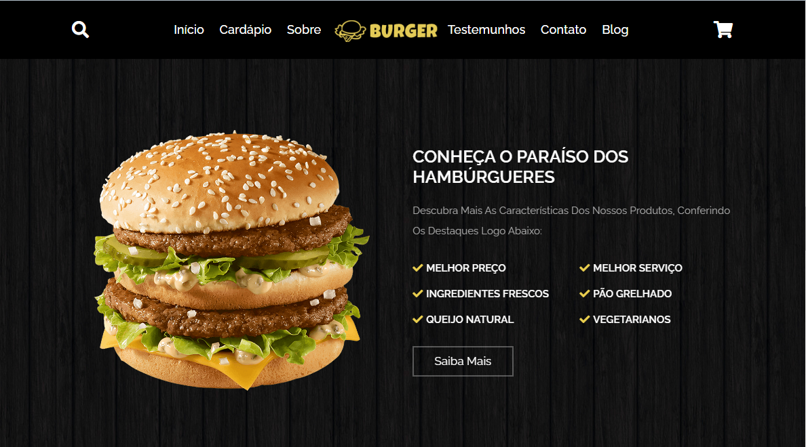
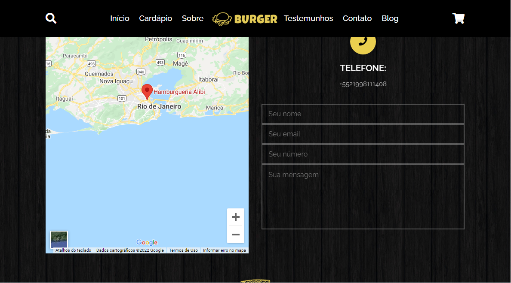

## 🍔 Burgeria
- Projeto de um website de uma hamburgueria totalmente feito em Javascript, HTML e CSS, com o uso de Sass. 
- Alguns screenshots do projeto:

  
  
  
  
  

<h2>Conversão de SCSS para CSS</h2>

Para converter o arquivo .scss, é possível utilizar o node-sass. Basta dar o seguinte comando no terminal para instalar as dependências do package.json:  <code>npm install</code>

 

Por fim, basta rodar o npm script que converte o .scss em .css:  <code>npm run sass</code>

 

Isso irá salvar todas as alterações feitas no arquivo Sass em CSS.

